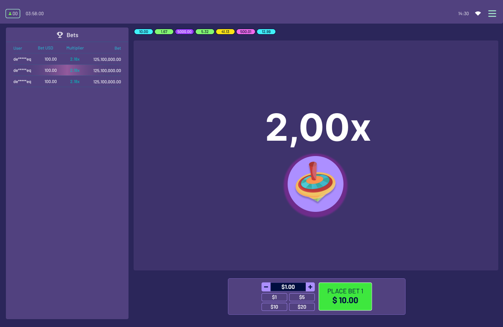

# Jogo Frontend Challenge

We are going to build a simple game using React as the UI framework and Pixi.js as the rendering engine.

The type of game we are gonna build is called "Crash".
In this game, players can enter a bet amount (from input or preset buttons).
After that, the game enters a "Running" phase, in which a number (multiplier) shown on the screen starts increasing until it crashes. The number can crash at any time, from 1 to 5000. When a player "withdraw" before the crash point, he wins an amount of (BET * multiplier), otherwise, he loses the bet amount.

The game should look like this: 

# Game Rules

- Players can only bet during "Betting" phase
- Players can only bet once
- Players can only cancel bet during "Betting" phase
- Players can only cashout out during "Running" phase and if bet is placed

## Task

Your task is to create this game UI integrated with the websocket api using React, as well as game animation logic using Pixi.js.
It should be responsive and work both on desktop and mobile devices.

## Steps

- Follow this figma [link](https://www.figma.com/design/bXJaCyGShFdum3VNcAcIPl/Crash---Frontend-Challenge?node-id=0-1&t=z7Yinb6Six03UUic-1) and implement the UI and integration with the websocket api
- Implement the animation logic

## Animaiton logic
- Code in the file located at `src/game/index.ts`
- Add an animated sprite to the scene using the file from `src/game/assets/texture.json`
- Change the animations based on the game state (betting - stopped, runnning - playing, crahed - crashed). (Last frame is the crash one)
- Change the multiplier text based on the multiplier sent by the server

## Tips before you begin

- Run the server with `npm run crash-server` - A websocket server will be running on port 8080
- Create components and organize the code
- Add comments to explain your logic on some of the functionalities
- Types and models can be found at `src/models/index.ts`
- For styling, use any lib that you are confortable with, or even css. We recommend using styled-components

## Resources

- [Pixi.js](https://pixijs.com/)
- [Websockets](https://developer.mozilla.org/en-US/docs/Web/API/WebSockets_API)

## Testing

Not needed for now, but feel free to add it